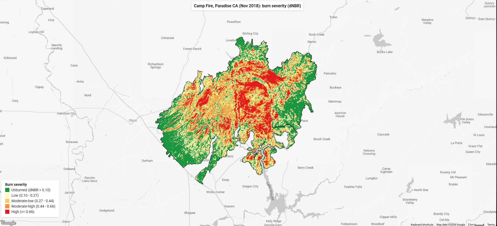

# Camp Fire Burn Severity Map

A Google Earth Engine script that maps wildfire burn severity from satellite imagery. Built as a portfolio project for remote sensing / disaster response work.

## What it does
Compares before and after Landsat 8 imagery of the 2018 Camp Fire (Paradise, CA) using the Normalized Burn Ratio (NBR) index, then classifies the burned area into severity levels from unburned to high.

## Example output

## How it works
1. Pulls Landsat 8 imagery from before and after the fire
2. Masks out clouds and cloud shadows
3. Calculates NBR for each time period
4. Subtracts them to get dNBR (the difference)
5. Classifies dNBR into 5 severity levels using standard USGS thresholds
6. Clips everything to the official fire perimeter (MTBS dataset)

## Run it yourself
[Open the script in Earth Engine](https://code.earthengine.google.com/1e3eefa8d8aa732766b6cf34de5c592a)

## Data sources
- Landsat 8 Collection 2 Level 2 (USGS/NASA)
- MTBS fire perimeter boundaries

## Limitations
Some low-severity pixels may reflect seasonal vegetation change rather than fire damage, since the pre-fire and post-fire image windows are in different seasons.
